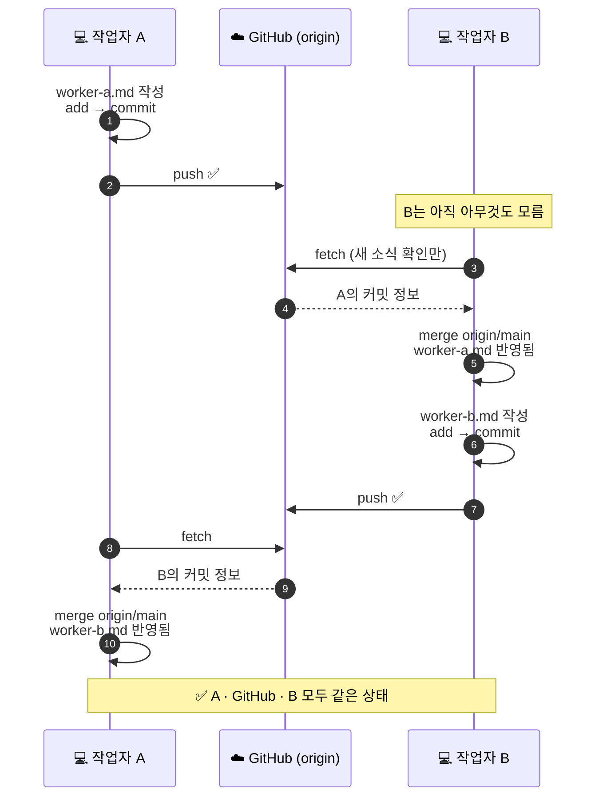
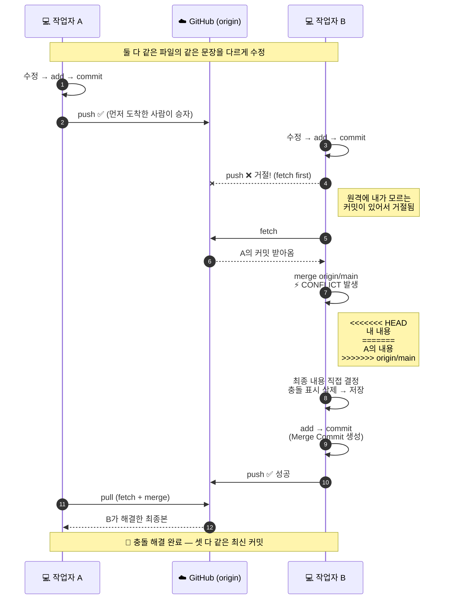

# 🔀 Git 협업 실습 — 시퀀스 다이어그램

> 4일차 실습: 작업자 A·B가 하나의 GitHub 저장소로 협업하며 충돌을 해결하는 전체 흐름

---

## 1️⃣ 충돌 없는 협업 — 서로 다른 파일을 수정

**핵심** — 다른 작업자의 변경은 **자동으로 내려오지 않는다.** `fetch`(확인) → `merge`(반영)를 직접 해야 한다.

---

## 2️⃣ 충돌 발생과 해결 — 같은 부분을 서로 다르게 수정

---

## 📌 한 장 요약

| 상황 | 명령 | 결과 |
|---|---|---|
| 내 작업 저장 | `add` → `commit` | 로컬 저장소에 버전 기록 |
| 올리기 | `push` | 원격이 앞서 있으면 **거절됨** |
| 받아오기 | `pull` (= `fetch` + `merge`) | 겹치면 **충돌**, 안 겹치면 자동 병합 |
| 충돌 해결 | 파일 수정 → `add` → `commit` → `push` | Merge Commit으로 마무리 |

> **면접용 한 줄** — "로컬 저장소는 서로 자동 동기화되지 않으며, push가 거절되면 fetch와 merge(=pull)로 원격 변경을 먼저 반영해야 합니다. 같은 부분을 다르게 수정한 경우 충돌이 발생하고, 이는 오류가 아니라 사람이 최종 내용을 결정해야 하는 정상 과정입니다."
