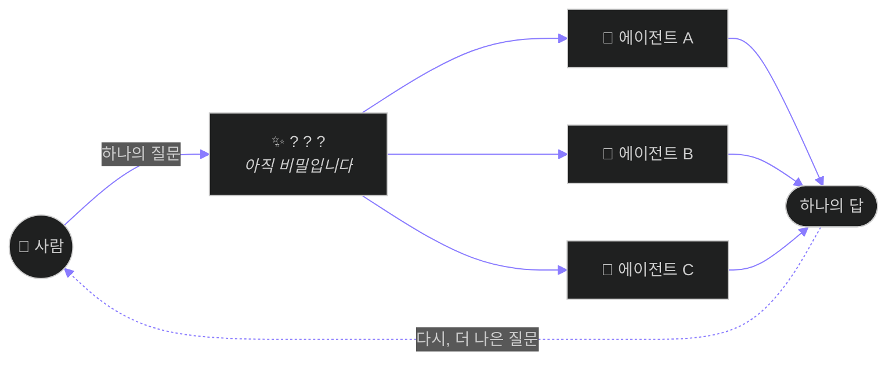

  

 

> **코드보다 구조를, 기능보다 가능성을 먼저 그립니다.**
> 하나의 뛰어난 도구보다, 도구들이 서로를 부르는 **흐름**이 더 많은 것을 바꾼다고 믿습니다.
> 지금은 그 흐름을 설계하는 법을 바닥부터 배우는 중입니다.

 

## 🧭 지금 그리고 있는 것

아직 이름을 붙이지 않은 무언가를 만들고 있습니다. 형태는 이렇습니다 —

가운데 상자가 무엇인지는, 조금 더 완성되면 열어 보이겠습니다.

 

## 🌱 지금의 단계

|  | 하고 있는 일 | 상태 |
|:---:|:---|:---:|
| 🧩 | 여러 AI 에이전트가 하나의 흐름으로 움직이는 구조 학습 | `배우는 중` |
| 🔬 | 배운 것을 매일 기록하고, 검증하고, 다시 쌓기 | `매일` |
| 🗺️ | "무엇을 가능하게 하는가"를 먼저 묻는 설계 연습 | `진행 중` |

 

## 🧭 지향점

- 만드는 사람과 쓰는 사람 사이의 **번역가**가 되는 것
- "어떻게 동작하는가"가 아니라 — **무엇을 가능하게 하는가**를 먼저 묻는 것
- 완성된 척하지 않고, **과정을 공개하며** 자라는 것

 

---

## 📂 이 저장소 — 파이썬 기초 학습 기록

AI 오케스트레이션 부트캠프 2기, 파이썬 기초 과정입니다.
수업에서 배운 것을 노트북으로 정리하고, 직접 실행해 검증한 코드만 올립니다.

| 폴더/파일 | 내용 |
|:---|:---|
| `1_입출력(정리).ipynb` | 입출력 기초 — 수업 내용을 다시 정리한 노트북 |
| `2_모듈_패키지_라이브러리.ipynb` | 모듈 · 패키지 · 라이브러리 개념과 실습 |
| `3_클래스와객체지향.ipynb` | 클래스와 객체지향 기초 |
| `My_First_Package/` | 직접 만든 첫 패키지 실습 (`Magic_Calc`) |
| `basic-python-animation/` | 🎬 자체 제작 파이썬 애니메이션 강의 (아래 ▶ 재생 링크) |
| `calc.py` 외 | 모듈 import 실습용 파일들 |

### 🎬 애니메이션 바로 재생

| EP | 제목 | 링크 |
|---|---|---|
| 01 | 출항 — 파이썬이라는 물길 | [▶ 재생](https://withandwithout0094.github.io/2026_aio2_python-basic/basic-python-animation/EP01-출항.html) |
| 02 | 기억 창고 — 변수와 자료형 | [▶ 재생](https://withandwithout0094.github.io/2026_aio2_python-basic/basic-python-animation/EP02-기억창고.html) |
| 03 | 글자의 기술 — 문자열 전용 편 | [▶ 재생](https://withandwithout0094.github.io/2026_aio2_python-basic/basic-python-animation/EP03-글자의기술.html) |
| 04 | 서가 정리 — 자료구조 4형제 | [▶ 재생](https://withandwithout0094.github.io/2026_aio2_python-basic/basic-python-animation/EP04-서가정리.html) |

자막 자동재생 · 📒 용어장 · 타이핑 즉시 실행 실험실 · 🎯 퀴즈 — 교재·PDF는 [python-rapids](https://github.com/WithAndWithout0094/python-rapids)

 

이야기가 더 궁금하시다면, 저장소들을 천천히 둘러보세요. 과정이 곧 소개입니다.

